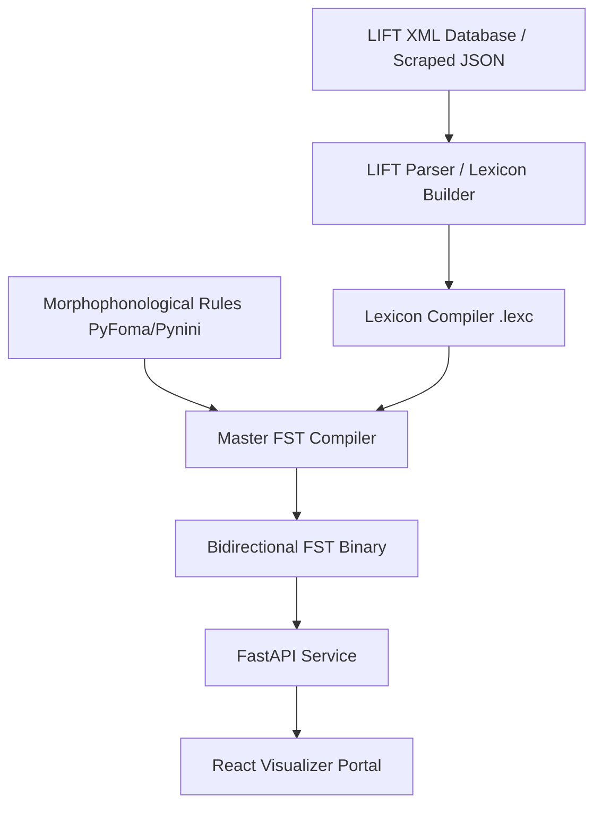

# Webonary Rungus Translator — Background Context & Project Blueprint

This document provides a comprehensive overview of the **Rungus Translator Project**, detailing the project's inspiration, repository structure, technical scraping architecture, parsing challenges, and the developmental roadmap (PRD) for the core system and alternative extensions.

---

## 1. Project Inspiration & Objective

The project is driven by **Aifven Nelson**, a young developer from Kudat, Sabah (of Rungus/Momogun descent), with a mission to preserve and promote the **Rungus language (ISO 639-3: `drg`)** by building a **Rungus Digital Translator** and offline dictionary tools.

### Personal & Academic Goals
*   **Ivy League Admissions (US)**: Establish a high-impact, culturally significant computer science research project demonstrating technical innovation (computational linguistics) and social responsibility (indigenous language preservation), suitable for prestigious science fairs (e.g., Regeneron ISEF).
*   **UK UCAS (Oxford, Cambridge, Imperial, UCL) Applications**: Create a highly technical "super-curricular" showcase demonstrating core data science skills, algorithmic modeling (Finite-State Automata), data engineering (efficient parsing), and statistics (consensus modeling).
*   **Data Science Mastery**: Transition from scraping flat web data to structural morphology, pipeline automation, active learning databases, and NLP.

### Correspondence with SIL Global
As documented in the email exchange in [CHRISTINE.pdf](file:///c:/backup/%21programming/RungusTranslator/CHRISTINE.pdf), Aifven reached out to Christine Dreiheller (a linguist at SIL Global managing the Rungus Webonary project) to request direct access to the database (LIFT XML or FLEx backup). 
- **Database Status**: The dictionary is an ongoing, manual compilation containing over 12,000 entries, with many entries still being updated, corrected, and expanded.
- **Linguistic Complexity**: Rungus is morphologically rich. It features dozens of prefixes, suffixes, and infixes combined with vowel harmony and morphophonemic changes. Root extraction and translation are highly complex tasks.
- **Scraping Decision**: Since direct database access was not immediately available, Aifven developed this web scraping project to programmatically extract the dictionary entries from the public-facing [Webonary Rungus Dictionary](https://www.webonary.org/rungus/).

---

## 2. Directory Structure & File Map

The workspace contains scripts, scraped data, reports, and logs to coordinate the scraping pipeline:

| File | Type | Purpose |
|------|------|---------|
| [webonary_rungus_report.md](file:///c:/backup/%21programming/RungusTranslator/webonary_rungus_report.md) | Documentation | Technical report outlining URL mapping, WordPress HTML structures, CSS selectors, and example scraping scripts. |
| [CHRISTINE.pdf](file:///c:/backup/%21programming/RungusTranslator/CHRISTINE.pdf) | Correspondence | Email thread between Aifven and SIL's Christine Dreiheller establishing project context and goals. |
| [scrape_full.py](file:///c:/backup/%21programming/RungusTranslator/scrape_full.py) | Python Script | Headless browser scraper using **Playwright** and **BeautifulSoup** to scrape the entire ~12,000 entries. Includes resume logic via `scrape_state.json`. |
| [scrape_100.py](file:///c:/backup/%21programming/RungusTranslator/scrape_100.py) | Python Script | A proof-of-concept scraper that collects the first 100 entries. |
| [mainDataset.json](file:///c:/backup/%21programming/RungusTranslator/mainDataset.json) | Data (JSON) | The full dataset consisting of all scraped entries (approx. 3.5 MB). |
| [scraped_words.json](file:///c:/backup/%21programming/RungusTranslator/scraped_words.json) | Data (JSON) | The output dataset from the 100-word test run. |
| [list_missing.py](file:///c:/backup/%21programming/RungusTranslator/list_missing.py) | Python Script | Validation script to identify entries lacking English/Malay translations or example sentences. |
| [missing_report.txt](file:///c:/backup/%21programming/RungusTranslator/missing_report.txt) | Text Report | Output of [list_missing.py](file:///c:/backup/%21programming/RungusTranslator/list_missing.py) detailing incomplete entries. |
| [review_scrape.py](file:///c:/backup/%21programming/RungusTranslator/review_scrape.py) | Python Script | Analyzes the quality of scraped entries (counting senses, sub-entries, empty definitions, and parsing errors). |
| [review_output.txt](file:///c:/backup/%21programming/RungusTranslator/review_output.txt) | Text Report | Logged output of [review_scrape.py](file:///c:/backup/%21programming/RungusTranslator/review_scrape.py) detailing 100-word sample metrics. |
| [issues.md](file:///c:/backup/%21programming/RungusTranslator/issues.md) | Log | Lists active bugs and parsing edge cases to be corrected. |
| [image.png](file:///c:/backup/%21programming/RungusTranslator/image.png) | Image | Visual reference highlighting web formatting for specific entries (e.g. the word "abai"). |

---

## 3. Technical Challenges & Web Scraping Strategy

1. **403 Forbidden & Cloudflare Protection**: Direct HTTP libraries (e.g., Python `requests`) are blocked with a `403 Forbidden` error. The scraper uses **Playwright** to launch a headless Chromium browser instance, spoofing realistic browser headers (`User-Agent`) and warming up the session via the homepage.
2. **Alphabetical Pagination**: Scraping progresses letter by letter through the Rungus alphabet (`a, b, d, e, g, h, i, j, k, l, m, n, o, p, r, s, t, u, v, w, y, z`). The scraper reads the `totalEntries` value from pagination links on page 1 of each letter, then iterates through pages `pagenr=1` to `pagenr=N`.
3. **Resumable State**: Due to the size of the dictionary, [scrape_full.py](file:///c:/backup/%21programming/RungusTranslator/scrape_full.py) saves state dynamically. If interrupted, it reads `scrape_state.json` to resume from the exact letter index and page number.

---

## 4. Specific Parsing Issues (The "Abai" Bug)

A key issue logged in [issues.md](file:///c:/backup/%21programming/RungusTranslator/issues.md) involves the word **"abai"** (and similar entries). 

### HTML Structure
In Webonary's server-rendered HTML, definitions are sometimes split across multiple sibling `<span>` tags within `<span class="definitionorgloss">`. For example, under "abai":
```html
<span class="definitionorgloss">
  <span class="writingsystemprefix">BM</span>
  <span lang="zlm">loteng,</span>
  <span lang="zlm">para-para</span>
  
  <span class="writingsystemprefix">Eng</span>
  <span lang="en">,</span>
  <span lang="en">loft, attic</span>
</span>
```

### Why Older Scrapers Failed
1. **Taking only the first child (`select_one`)**: Early proof-of-concept scripts extracted only the first match, capturing `","` as the English definition.
2. **Naive Joining (`.join`)**: The updated scrapers join all texts matching `[lang='en']`. For "abai", this results in:
   - **English**: `", loft, attic"` (a leading comma artifact)
   - **Malay**: `"loteng,para-para"` (merged words missing a space after the comma since the space resides outside the span tags)

### Proposed Correction
To clean up these definitions during parsing:
- Merge definition spans with appropriate spacing (e.g. adding a space if joining non-punctuation elements).
- Strip leading/trailing punctuation characters (like commas `,` and semicolons `;`) and whitespace.
  ```python
  def clean_joined_definitions(tags):
      texts = [t.get_text().strip() for t in tags]
      texts = [t for t in texts if t]
      full_text = " ".join(texts)
      full_text = re.sub(r'\s+', ' ', full_text)
      full_text = re.sub(r',\s*', ', ', full_text) # Ensure space after commas
      return full_text.strip().strip(",").strip(";").strip()
  ```

---

## 5. Product Requirement Document (PRD): RungusFST System

### 5.1 Project Overview & Objective
The **RungusFST** system is an open-source Finite-State Morphological Compiler and LIFT-Driven API designed specifically for the Rungus (Momogun) language. It addresses the **agglutinative and non-concatenative morphology** of Rungus (infixes, vowel harmony, vowel contraction, nasal substitutions) by modeling grammar rules mathematically into **Finite-State Transducers (FST)** in Python using libraries like **PyFoma** or **Pynini**. This replaces the closed legacy FLEx Hermit Crab parser with a modern web API.

### 5.2 System Requirements
*   **Bidirectionality**: The transducer must handle:
    *   *Analysis*: Mapping surface words to lexical roots and grammatical tags (e.g., `pinongimot-ku` $\rightarrow$ `imot + [Active] + [Past] + [1P.Gen]`).
    *   *Generation*: Compiling roots and tags into correct surface representations.
*   **Low-Resource Architecture**: Operates purely on rule-based transducers, bypassing the lack of massive parallel text corpora needed for neural machine translation (NMT).
*   **Memory Efficiency**: Utilizes streaming XML parsing (`lxml.iterparse`) to process LIFT dictionary formats without loading the entire tree into RAM.

### 5.3 System Architecture


### 5.4 Phased Roadmap (6–12 Months)
*   **Phase 1: Automated LIFT-to-Foma Lexicon Compiler (Months 1-2)**: Ingests structured XML/JSON data, normalizes lexicographical boundaries, and compiles grammatical classes (`.lexc`).
*   **Phase 2: Morphophonological Rule Engineering (Months 3-6)**: Encodes rules for Rungus vowel harmony (e.g., adjective prefix `^A-` resolving to `o-` or `a-` depending on root vowels), vowel contraction, and infixes (`-in-`, `-um-`) using regular expressions and composition.
*   **Phase 3: FST Web API Integration (Months 7-8)**: Exposes endpoints `/analyze` and `/generate` using FastAPI.
*   **Phase 4: Visualizer & Field Validation (Months 9-12)**: Develops a web-based parse-tree visualizer, sets up regression testing suites using vernacular texts, containerizes using Docker, and drafts a computational linguistics research paper.

---

## 6. Project Expansion: Crowdsourced Human-in-the-Loop Active Learning (MomogunAlign)

Endangered and minority languages face a severe "dirty data" problem. Automatic scraping contains artifacts (as seen in the "abai" bug), and dictionary databases under active development contain omissions (identified by [list_missing.py](file:///c:/backup/%21programming/RungusTranslator/list_missing.py)).

To address this, we propose **MomogunAlign**, a crowdsourcing portal designed to validate dictionary entries and bootstrap data quality using **Human-in-the-Loop (HITL)** reinforcement.

### How MomogunAlign Works:

```mermaid
graph LR
    A[Raw Scraped JSON / FST Output] --> B[Confidence Scoring Filter]
    B -->|Low Confidence / Missing Fields| C[Micro-Task Generator]
    C --> D[Crowdsourced Web Portal]
    D -->|Volunteers / Community Elders| E[Consensus Aggregation Algorithm]
    E -->|High Consensus| F[Clean Gold-Standard Corpus]
    F --> G[Updated FST & Main Dataset]
```


1.  **Confidence Scoring & Task Generation**: A python backend scans the dataset. Any entry with missing translations, punctuation artifacts (like leading commas), or parsing failures is flagged.
2.  **Volunteer Micro-Tasks**: Flagged words are converted into simple, mobile-friendly questions for bilingual Rungus-English-Malay volunteers:
    *   *Task A (Translation Validation)*: "Does the word **abai** mean **loft, attic**? (Yes/No)"
    *   *Task B (Morphology Verification)*: "What is the root word of **pinongimot**? (a) imot, (b) pongimot, (c) kimot"
    *   *Task C (Contextual Review)*: "Is this example sentence natural? [Sentence] (Scale 1–5)"
3.  **Statistical Consensus Modeling (Data Science Core)**: 
    Since volunteers may make mistakes, the platform uses data science consensus algorithms:
    *   *Majority Voting*: Simple thresholding.
    *   *Dawid-Skene Model (Expectation-Maximization)*: Estimates the hidden "true" translation while simultaneously calculating each volunteer's reliability score. This prevents spam or incorrect inputs from corrupting the dataset.
4.  **Automatic Feedback Loop**: Verified corrections are committed back to `mainDataset.json` and compiled into the FST testing suite, improving translation accuracy iteratively.

---

## 7. Additional Research Projects Using the Scraped Datasets

Beyond the morphological analyzer and active learning portals, the 12,000-word dataset can power several other prestigious research projects:

### 1. Cross-Lingual Semantic Search & Vector Retrieval
*   **The Concept**: Traditional dictionary lookups require exact string matches. A Semantic Search Engine utilizes cross-lingual sentence embeddings (like `mBERT` or `XLM-RoBERTa`) to match queries conceptually.
*   **Data Science Skill**: Text preprocessing, vector embedding generation, vector databases (e.g., Pinecone or ChromaDB), and cosine similarity evaluation.
*   **Example**: Searching English for "tools used for weeding paddy fields" returns Rungus verbs and tools (like *tosu*) even if the English word "weeding" is not in their literal definitions.

### 2. Evaluative Study of Multilingual LLMs on Low-Resource Dialects
*   **The Concept**: Analyze how well commercial models (Gemini, GPT-4, Grok) handle Rungus vocabulary and grammar. Use the scraped dataset as a "gold-standard" test suite.
*   **Research Focus**: Benchmark accuracy for zero-shot translation. Analyze why LLMs hallucinate or default to Malay when queried in Rungus, proving the necessity of local, rule-based systems like RungusFST.

### 3. Dialectal Mapping & Visual Ethno-Linguistic Atlas
*   **The Concept**: Map Rungus semantic domains (botany, agricultural tools, traditional kinship terms) visually.
*   **Data Science Skill**: Clustering (K-Means), Dimensionality Reduction (t-SNE/UMAP) of embeddings, and interactive geographic mapping (Folium/D3.js) to show variations across Kudat sub-districts.
