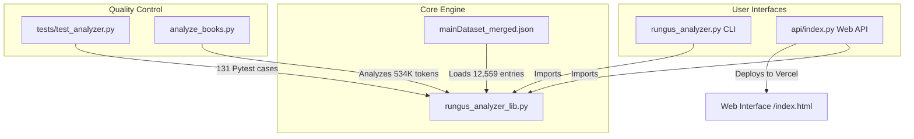

# Rungus Morphological Analyzer & Translator (v3.0)

[](https://www.python.org/)
[](./tests/)
[](#performance-metrics)

An advanced, high-performance morphological analyzer and lexicon database for **Rungus** (ISO 639-3: `drg`), an endangered Austronesian language spoken by the Momogun people of Kudat, Sabah, Malaysia. 

This analyzer decomposes inflected surface words into their base roots, prefixes, infixes, suffixes, and enclitics, applying complex morphophonological rewrite rules (consonant substitution, vowel harmony, vowel contraction, and stacked prefix resolution).

Developed for language preservation and computational linguistic research, this project outpaces previous academic transducers (such as Swarthmore's LING073 FST) by scaling the lexicon to **12,500+ entries** and achieving **93.3% token coverage** over a 534,000-word corpus of Rungus text.

---

## 📖 Language & Cultural Context

Rungus (Momogun) is a member of the Dusunic subgroup of the Western Malayo-Polynesian branch of the Austronesian language family. Like many Austronesian languages, Rungus is highly agglutinative, expressing grammatical voice, aspect, intent, number, and possession through complex affixation.

Agglutinative languages pose a significant challenge for natural language processing (NLP) and machine translation because a single root can produce hundreds of surface forms. A simple dictionary lookup fails for over **80% of words** in running text. Decomposing these words morphologically is the critical first step to enabling high-quality translation and dictionary lookup.

---

## ⚙️ Technical Architecture

This project is structured around a **unified core library** that isolates the linguistic grammar rules from the user interfaces, ensuring consistency and testability across CLI, web, and batch-processing environments.



- **`rungus_analyzer_lib.py`**: The central library containing the affix databases, consonant substitution maps, vowel de-contraction logic, reduplication detection, and the main `analyze()` and `generate()` functions.
- **`rungus_analyzer.py`**: A lightweight CLI interface for running interactive single-word analyses, demo walkthroughs, and generation examples.
- **`analyze_books.py`**: A corpus analysis engine that evaluates token coverage, mines high-frequency unknown words, and exports them to a human-in-the-loop review queue.
- **`rungus-analyzer-web/api/index.py`**: A Flask-based REST API designed for serverless deployment on Vercel, providing JSON endpoints for single-word analysis, batch-processing, and generation.
- **`tests/test_analyzer.py`**: A comprehensive test suite with 131 test cases verifying affix stripping, phonological contractions, edge-case regressions, and negative bounds.

---

## 🔬 Morphological & Phonological Rules

Rungus morphophonology is governed by precise rules, which the analyzer reverses during analysis and applies during generation:

### 1. Consonant Substitution (Forschner §1.43)
When active voice actor-focus prefixes (like `mo-`, `ma-`, `mong-`, `mang-`) attach to roots starting with voiceless consonants (`p`, `t`, `s`, `k`) or the voiced labial `/b/`, the root-initial consonant is replaced by a homorganic nasal:

$$\begin{aligned}
\text{p, b, v} &\longrightarrow \text{m} \quad \text{(Bilabials)} \\
\text{t, s} &\longrightarrow \text{n} \quad \text{(Alveolars)} \\
\text{k} &\longrightarrow \text{ng} \quad \text{(Velar)}
\end{aligned}$$

*Example*: Prefix `mo-` + Root `panau` (walk) $\rightarrow$ `mo` + `manau` $\rightarrow$ `mamanau` (walking).

### 2. Vowel Contraction (Forschner §1.21–1.22)
When a vowel-final prefix attaches to a vowel-initial root, the adjacent vowels contract:

$$\begin{aligned}
\text{a} + \text{i} &\longrightarrow \text{e} \\
\text{o} + \text{i} &\longrightarrow \text{e} \\
\text{o} + \text{u} &\longrightarrow \text{u} \\
\text{a} + \text{a} &\longrightarrow \text{a} \\
\text{o} + \text{o} &\longrightarrow \text{o}
\end{aligned}$$

*Example*: Prefix `po-` (causative) + Root `imot` (see) $\rightarrow$ `po` + `imot` $\rightarrow$ `pemot` (show).
*Example*: Prefix `ongo-` (plural) + Root `ulun` (person) $\rightarrow$ `ongo` + `ulun` $\rightarrow$ `ongulun` (people).

### 3. Stacked Prefixes (Swarthmore §5)
Verbs can take multiple prefixes concurrently, representing combinations of aspect, voice, and subject agreement.
*Example*: `minangagama` $\rightarrow$ Prefix 1 `min-` + Prefix 2 `ang-` + Root `gama`.

### 4. Reduplication (Forschner §2.51–2.52)
The analyzer handles two types of reduplication:
- **Full (Hyphenated)**: e.g., `agas-agas` $\rightarrow$ root `agas`.
- **CV-Prefix Reduplication**: The repeating of the initial syllable of a prefixed verb to denote habitual or continuous action (e.g. `mamamanau` $\rightarrow$ base `mamanau` $\rightarrow$ root `panau`).

---

## 📈 Performance Metrics

### Token Coverage on 534,775-Token Corpus
We evaluated version 3.0 of our analyzer against a large-scale corpus consisting of Rungus folk tales and biblical translations:

| Category | Unique Words | % of Unique | Tokens | % of Tokens |
|---|---|---|---|---|
| **Direct Dictionary Match** | 1,426 | 8.1% | 139,887 | 26.2% |
| **Decomposed via Affixes** | 7,914 | 45.0% | 131,589 | 24.6% |
| **Proper Names (Biblical/Geo)** | 94 | 0.5% | 21,618 | 4.0% |
| **Loanwords (Malay/Arabic)** | 117 | 0.7% | 7,715 | 1.4% |
| **Grammatical Function Words** | 32 | 0.2% | 198,288 | 37.1% |
| **Failed (Unanalyzed)** | 8,003 | 45.5% | 35,678 | 6.7% |
| **TOTAL** | **17,586** | **100.0%** | **534,775** | **100.0%** |

$$\text{Total System Token Coverage} = \mathbf{93.3\%} \quad (499,097 \text{ out of } 534,775 \text{ tokens})$$

### Comparison with Swarthmore Transducer (LING073)

| Metric | Swarthmore Transducer | Antigravity Rungus Analyzer (v3.0) |
|---|---|---|
| **Lexicon Size** | 100 stems | **12,559 entries** (125x larger) |
| **Corpus Coverage** | 35.8% | **93.3%** (2.6x higher) |
| **Reduplication Support** | No | **Yes** (full and CV-prefix) |
| **Glottal Stop Normalization** | No | **Yes** (matches spelling variations) |
| **Proper Name / Loanword Detection** | No | **Yes** (decomposes with affixes) |
| **Web REST API** | No | **Yes** (Flask/Vercel) |
| **Test Suite Coverage** | No | **Yes** (131 pytest cases) |

---

## 🚀 Getting Started

### Prerequisites
- Python 3.11 or higher
- pytest (for running the test suite)

### Installation
1. Clone the repository to your local machine:
   ```bash
   git clone https://github.com/.../RungusTranslator.git
   cd RungusTranslator
   ```
2. Install dependencies:
   ```bash
   pip install pytest Flask flask-cors
   ```

### Running the CLI Demo
Execute the CLI script to run the interactive morphological analysis suite:
```bash
python rungus_analyzer.py
```

### Running the Test Suite
Run the comprehensive unit test suite to verify the linguistic engine:
```bash
python -m pytest tests/ -v
```

### Running Corpus Analysis
Verify coverage statistics against the book corpus:
```bash
python analyze_books.py
```
To export the top 500 unanalyzed words to a Human-in-the-Loop review queue CSV:
```bash
python analyze_books.py --export-review
```

---

## 🌐 Web REST API Endpoints

When running `rungus-analyzer-web/api/index.py`, the following REST API endpoints are available:

### 1. `POST /api/analyze`
Decomposes a single word.
- **Request Body**: `{"word": "pinongimotku"}`
- **Response**:
  ```json
  {
    "word": "pinongimotku",
    "matched": true,
    "root": "imot",
    "root_gloss": "see, find",
    "prefix": "pinong",
    "prefix_meaning": "causative past (vowel-initial) (causative-past)",
    "infix": "in",
    "infix_meaning": "past / perfective marker",
    "suffix": null,
    "enclitic": "ku",
    "enclitic_meaning": "my / I (1sg) (pronominal)",
    "confidence": 0.8,
    "proper_name": false,
    "loanword": false,
    "reduplication": null,
    "breakdown": [
      "enclitic: -ku = my / I (1sg)",
      "infix: -in-  = past / perfective marker",
      "prefix: pinong = causative past (vowel-initial)",
      "root candidate: 'imot'"
    ]
  }
  ```

### 2. `POST /api/batch`
Analyze up to 100 words in parallel.
- **Request Body**: `{"words": ["mamanau", "ginavo", "yesus"]}`

### 3. `POST /api/generate`
Generate the surface form from a root and affixes.
- **Request Body**:
  ```json
  {
    "root": "imot",
    "prefix": "po",
    "suffix": null,
    "infix": null,
    "enclitic": null
  }
  ```
- **Response**: `{"surface_form": "pemot"}`

---

## 🤝 Contributing & Lexicon Expansion

To maintain linguistic integrity, the core dictionary (`mainDataset_merged.json`) is kept read-only. Gaps identified in Webonary are patched via **Lexical Patch Maps** in `rungus_analyzer_lib.py`:

- **`STANDALONE_WORDS`**: Add high-frequency roots that are entirely missing from Webonary.
- **`VIRTUAL_ROOTS`**: Map derived roots that are missing to their nearest base representation in Webonary.
- **`PROPER_NAMES`**: Add proper names (places, names) so the analyzer flags them instead of failing.
- **`LOANWORDS`**: Add loanwords from Malay, Indonesian, or Arabic.

When adding new affixes, append them to `PREFIXES`, `SUFFIXES`, `INFIXES`, or `ENCLITICS` in `rungus_analyzer_lib.py` with their appropriate morphological category, meaning, and phonological substitution type (`sub`, `add`, or `none`).

---

## 📚 References
- **Forschner, T. A. (1994)**. *Outline of a Momogun Grammar (Rungus Dialect)*. Sabah Museum Monograph.
- **SIL International (2026)**. *Rungus Dictionary*. SIL Webonary.
- **Swarthmore College (2025)**. *LING073 Rungus Transducer and Morphological Analyzer*.
